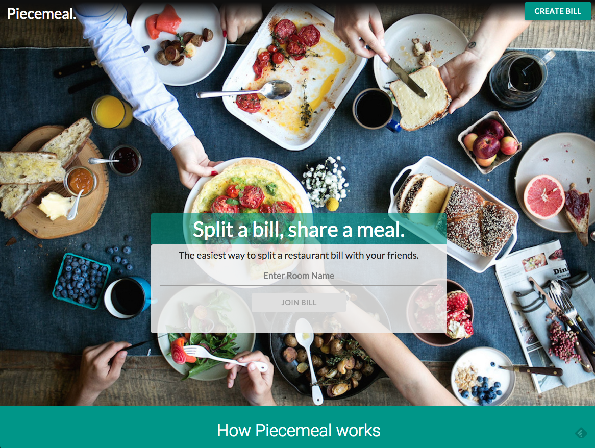

# Piecemeal.us

The easiest way to split a bill. Try it out at [piecemeal.us](http://www.piecemeal.us/).



## Table of Contents

1. [Team](#team)
1. [Usage](#usage)
1. [Development](#development)
    1. [Requirements](#requirements)
    1. [Installing dependencies](#1-installing-dependencies)
    1. [Local database setup](#2-local-database-setup)
    1. [Starting the server](#3-starting-the-server)
    1. [Further dev instructions](#4-further-dev-instructions)
1. [Testing](#testing)
1. [Roadmap](#roadmap)
1. [Contributing](#contributing)


## Team


  - __Scrum Master__: Jackson Sharf   |  [LinkedIn](https://www.linkedin.com/in/jacksonsharf)  |  [Github](https://github.com/5harf)


  - __Product Owner__: Fawn Bertram  |  [LinkedIn](https://www.linkedin.com/in/fawnbertram)  |  [Github](https://github.com/Faline10)


  - __Front-End Engineer__: Michelle Lee  |  [LinkedIn](https://www.linkedin.com/in/michellemhlee)  |  [Github](https://github.com/mi-lee)


## Usage


#### Using the appplication

Piecemeal is live! You can try it out at at **[piecemeal.us](http://www.piecemeal.us/)**.


## Development

#### Requirements

- Node 4.2.x
- PostgreSQL 9.1.x

#### 1. Installing dependencies

```
sudo npm install -g bower
npm install
bower install
```

#### 2. Local database setup
1. Install [Postgres.app](http://postgresapp.com/) - full-featured PostgreSQL installation w/ `psql` CLI
2. Install [Postico](https://eggerapps.at/postico/) *_(optional)_* - PostgreSQL Client for OSX aka GUI. Double check that Postgres.app is running from your OSX toolbar. It should indicate that you are running port **5432**.
3. Use Postgres CLI to create the database:

```
psql
CREATE USER admin WITH SUPERUSER;
ALTER USER admin WITH PASSWORD 'admin';
SET ROLE admin;
CREATE DATABASE piecemeal;
```


#### 3. Starting the server

a. Starting using Grunt **(recommended)**:

The [Gruntfile](https://github.com/mi-lee/Piecemeal/blob/master/Gruntfile.js) has been setup so that starting up the application for dev purposes is as painless as possible.

```
grunt init
grunt start
```

This will start up the database, start the server, set up livereload and `grunt watch` to lint, run tests and create documentation as you change the files. [See the Gruntfile](https://github.com/mi-lee/Piecemeal/blob/master/Gruntfile.js) for more information on setup.

b. Or with a simple node command:

```
node server/server.js
```

### 4. Further dev instructions

There is a file called ['venmoApiKeysFILL-IN.js'](https://github.com/mi-lee/Piecemeal/blob/master/venmoApiKeysFILL-IN.js) in the root folder. Add your developer keys from [Venmo](https://developer.venmo.com/) and rename it **'venmoApiKeys.js'**.

Most problems can be solved by dropping the database. To clear it, stop the server and run:

```
psql
drop database piecemeal;
create database piecemeal;
```

## Testing

We used [Jasmine](http://jasmine.github.io/) and [Karma](https://karma-runner.github.io/0.13/index.html) to test our Angular components, and used [ngMock](https://docs.angularjs.org/api/ngMock) and [angular.mock.inject](https://docs.angularjs.org/api/ngMock/function/angular.mock.inject). Check [our Karma config file](https://github.com/mi-lee/Piecemeal/blob/master/karma.conf.js) for more details.

To run the tests, just run:

```
karma start karma.conf.js
```


## Roadmap

See [ROADMAP.md](ROADMAP.md) for more information.

## Frequently Asked Questions

1. Why is everything in an IIFE in the client-side Angular files?

We follow John Papa's [Angular Style Guide](https://github.com/johnpapa/angular-styleguide), a comprehensive guide on syntax and structure of Angular components for greater readability and clarity.

## Contributing

See [CONTRIBUTING.md](CONTRIBUTING.md) for contribution guidelines.


